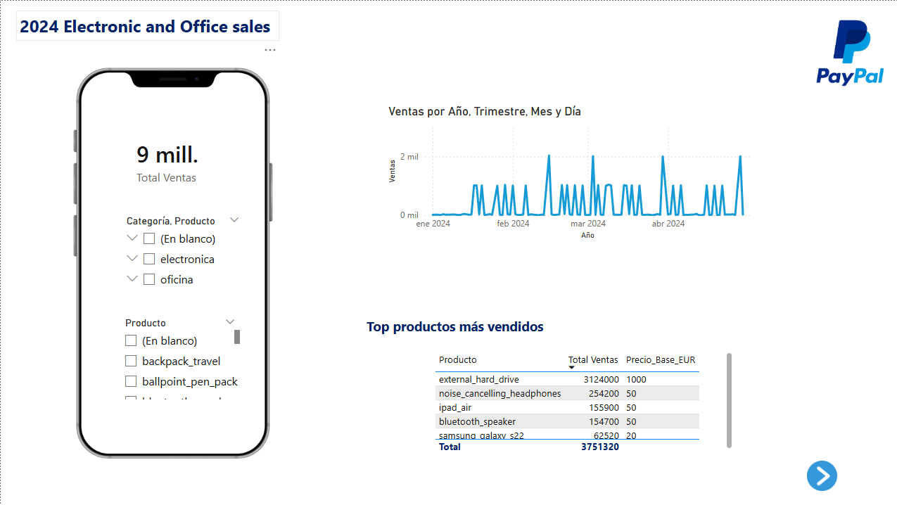
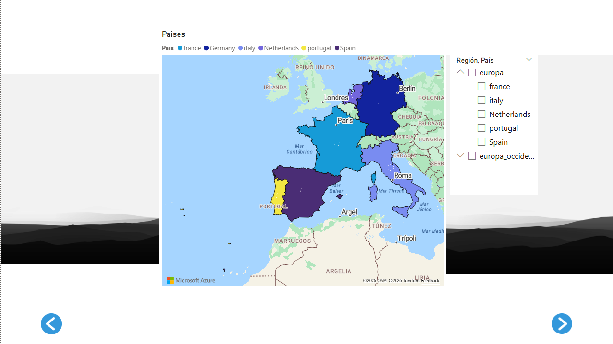

Dashboard interactivo de ventas 2024 - Electrónica y Oficina (Power BI)
# Análisis de Ventas Europa 2024 - Power BI

Dashboard interactivo para el análisis de **9 millones de ventas** en 6 países de Europa (Francia, Alemania, Italia, Países Bajos, Portugal y España).

## Características principales

- Análisis geográfico por país y ciudad
- Top productos más vendidos
- Análisis de vendedores por edad y género
- Evolución temporal de ventas
- Filtros interactivos por categoría, país, etc.

## Tecnologías utilizadas
- Power BI Desktop
- DAX
- Power Query
- Mapas personalizados

## Capturas del Dashboard

## Cómo usar el proyecto

1. Descarga el archivo `Ventas_Europa_2024.pbix`
2. Ábrelo con **Power BI Desktop** (gratuito)
3. Explora los filtros e interactúa con el dashboard

## Enlace al archivo
[Descargar .pbix](nombre-de-tu-archivo.pbix)
