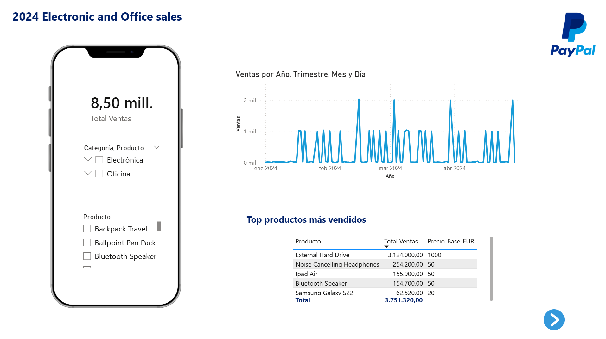
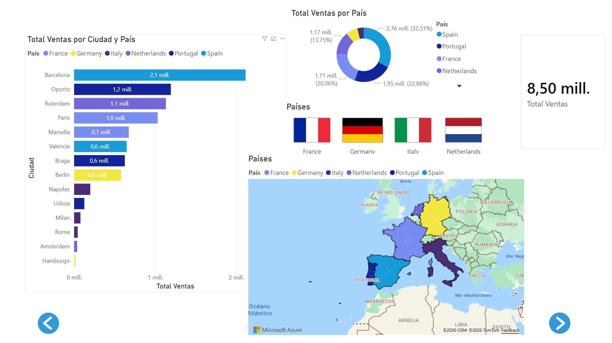
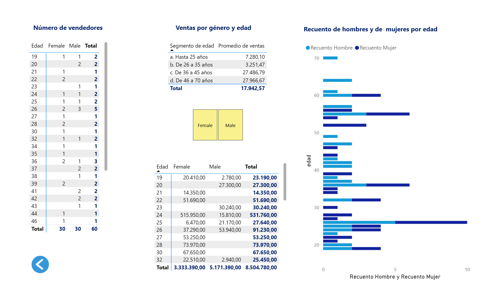

Dashboard interactivo de ventas 2024 - Electrónica y Oficina (Power BI)
# Power BI Dashboard : Análisis de Ventas con Paypal Europa 2024 

Dashboard interactivo para el análisis de **9 millones de ventas** en 6 países de Europa (Francia, Alemania, Italia, Países Bajos, Portugal y España). El reporte refleja las ventas de productos electrónicos y de oficina realizadas a través de la plataforma PayPal.

## Cómo usar el proyecto

1. Descarga el archivo o mira las capturas de esta página.
2. Ábrelo con **Power BI Desktop** si quieres probar su interactividad.
   
[Descarga](Analisis_Alejandro_Torres.pbix)

## Características principales

- Análisis geográfico por país y ciudad
- Top productos más vendidos
- Análisis de vendedores por edad y género
- Evolución temporal de ventas
- Filtros interactivos en cada una de las páginas

## Tecnologías utilizadas
- Power BI Desktop
- DAX
- Power Query
- Azure Maps

## Capturas del Dashboard

